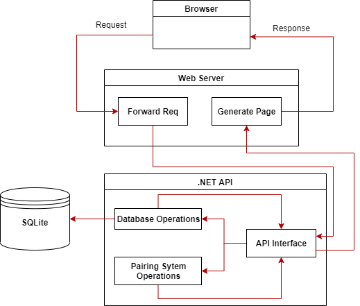

# ChessPairingPlatform - platforma sieciowa służąca do parowania graczy w amatorskich turniejach szachowych. Projekt pracy inżynierskiej, który został obroniony w sierpniu 2020 roku.
### Celem przedstawionej pracy jest stworzenie platformy sieciowej za pomocą wysokopoziomowych narzędzi oraz ogólnie przyjętych praktyk tworzenia oprogramowania. Aplikacja ma umożliwiać kojarzenie graczy w amatorskich turniejach szachowych bez potrzeby instalacji dodatkowego oprogramowania na sprzęcie lokalnym. Pomniejszym celem jest stworzenie autorskich systemów parowań pozwalających na przebieg turnieju zgodnie z założeniami przyjętymi przez Międzynarodową Organizację Szachową [FIDE]. Praca zawiera opisy działania algorytmów wraz ze schematami blokowymi, projekt platformy sieciowej oraz opis napotkanych problemów wraz z ich rozwiązaniem.

### Wykorzystane technologie.
1. .NET Core z użeciem języka C# - narzędzie zostało użyte do stworzenia REST API, który z kolei posłużył do komunikacji między użytkownikiem a bazą danych i algorytmami parowania.
2. NodeJS oraz ExpressJS - narzędzia zostały użyte do stworzenia strony internetowej, która umożliwia tworzenie, modyfikację i przeprowadzanie turniejów szachowych.
3. PUG - silnik generowania szablonów, który jest kompatybilny z NodeJS.
4. SQLite - lekka baza danych do przechowywania informacji.

### Opis działania.
Użytkownik wysyła żądanie poprzez przeglądarkę internetową. Serwer internetowy je przetwarza i przekazuje dalej do serwera API.Interfejs API decyduje co zrobić z żądaniem po czym  odsyła odpowiedź. Silnik szablonów generujeodpowiednią stronę na podstawie otrzymanych danych. Serwer internetowy wysyła wygenerowaną stronę użytkownikowi.

### Do repozytorium dołączam plik PDF (Praca-Inz-2020.pdf) z pracą inżynierską.

### Najnowsza wersja programu znajduje się na branch'u "features". TODO naprawa commit history oraz merge na master.
